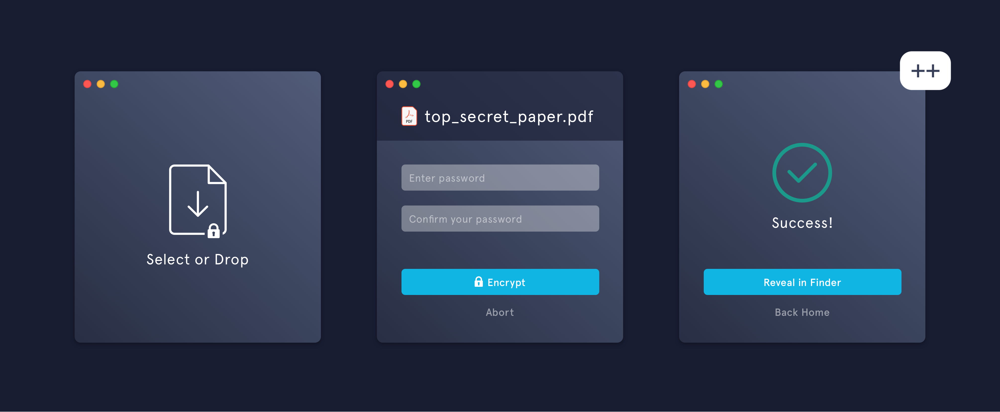

# Deadbolt++



`Deadbolt++` simplifies encrypting and decrypting files. All you need is a password.

Select a file to encrypt, enter a password, and … that’s it. Decryption is just as easy.

You can download `Deadbolt++` for **Mac OS** and **Linux**. Any encrypted file can be shared across these platforms.

> Note: `deadbolt++` can not encrypt directories. To encrypt a directory, compress it into a `.zip` (or any archive format) file before using `deadbolt++`.

## Acknowledgment

This is a fork of the [deadbolt](https://github.com/alichtman/deadbolt) project, with the aim of improving the security of the tool and adding more useful features. The aim is to upstream any relevant changes to the original project.

## Installation

Download the latest release [here](https://github.com/maxturmult/deadboltplusplus/releases) or [build from source.](https://github.com/maxturmult/deadboltplusplus/blob/main/docs/development-guide.md)

## How it Works

### Non-Technical Version

`Deadbolt++` uses a proven, secure encryption algorithm to make sure your files stay safe.

### Technical Version

`Deadbolt++` is built on Electron and uses `crypto.js` from the `node.js` standard library. The encryption protocol used is `AES-256-GCM`. This algorithm is part of the NSA's [Commercial National Security Algorithm Suite](https://apps.nsa.gov/iaarchive/programs/iad-initiatives/cnsa-suite.cfm) and is approved to protect up to TOP SECRET documents. A 256-bit derived key for the cipher is created using 100,000 iterations of `pbkdf2` with the `SHA-512` HMAC digest algorithm, a 64-byte randomly generated salt, and a user generated password. The authenticity of the data is verified with the authentication tag provided by using GCM. These parameters were chosen by following the [NIST Guidelines for pbkdf2](https://nvlpubs.nist.gov/nistpubs/Legacy/SP/nistspecialpublication800-132.pdf).

**Note**: The original [deadbolt](https://github.com/alichtman/deadbolt) project uses a different, less secure `pbkdf2` iteration count. Files encrypted with `deadbolt` are therefore not currently compatible with `Deadbolt++` and vice versa.

## FAQ

### Showing Extensions on `macOS`

By default, `macOS` hides file extensions. To reduce confusion about what type each file is, I recommend configuring `macOS` to show file extensions. You can do that with the following command: `$ defaults write NSGlobalDomain AppleShowAllExtensions -bool true && killall Finder`.

### Setting `deadbolt++` as Default App for `.dbolt` Files on macOS

You can set this app as the default app for `.dbolt` files, which means you'll be able to double-click on `.dbolt` files to open them with `deadbolt` for decryption.

You can set this up the first time you double-click on a `.dbolt` file, or by right-clicking on a `.dbolt` file, selecting `Get Info` and changing the default app in the `Open With:` section.

To do this programmatically, run the following snippet:

```bash
$ brew install duti
$ duti -s org.turmult.deadbolt dyn.ah62d4rv4ge80k2xtrv4a all
```

The output of `$ duti -x dbolt` should then be:

```bash
$ duti -x dbolt
Deadbolt.app
/Applications/Deadbolt.app
org.turmult.deadbolt
```
